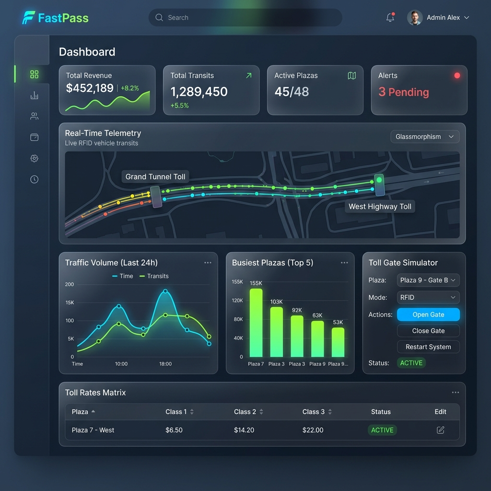

# Smart Toll Management Dashboard System

A real-time, modern full-stack web application designed for smart highway toll plazas. This project modernizes the legacy Java Swing app into a web-based, cloud-ready operational dashboard featuring live RFID entry/exit gate simulation, dynamic pricing matrices, and real-time passage telemetry.



## 📺 Demo Video
<video src="./Demo Video-Smart Toll Management Dashboard.mp4" controls width="100%"></video>

---

## 🚀 Key Features

1. **Live Lane Simulator**: Simulate RFID vehicle transits across toll segments (Mindanao Ave, Valenzuela, Bocaue, etc.) with instant wallet charge validations and balance warning triggers.
2. **Rates Matrix Controller**: Update segment pricing configurations for Class 1 (Cars), Class 2 (Buses/Trucks), and Class 3 (Heavy) vehicles directly from the UI. Changes propagate to active lanes in real-time.
3. **Telemetry Streaming**: Real-time event logging using Server-Sent Events (SSE) to update the dashboard instantly upon vehicle entrance and exit.
4. **Interactive Dashboard Charts**: Visualize traffic volumes, busiest plazas, and revenue splits using animated, responsive React charts.
5. **Historical passage log**: Searchable historical database of all toll transits and transaction billing audits.

---

## 🛠️ Technology Stack

* **Frontend**: React, TypeScript, Vite, Tailwind CSS, Lucide Icons, Recharts.
* **Backend**: Node.js, Express, TypeScript, Server-Sent Events (SSE).
* **Database & ORM**: SQLite, Prisma ORM.

---

## ⚙️ How to Install and Run

Make sure you have **Node.js (v18+)** installed.

### 1. Install all dependencies
Run the installation command at the project root folder. This automatically installs package dependencies for both the frontend and backend modules:
```bash
npm run install:all
```

### 2. Initialize Database & Seed Rates
Generate the SQLite database, run the Prisma schema migrations, and parse the legacy distance/price txt files to seed the toll plazas:
```bash
npm run db:init
```

### 3. Run the Development Servers
Start both the backend API and frontend Vite servers concurrently with a single command:
```bash
npm run dev
```

* **Frontend Dashboard**: Open [http://localhost:5173](http://localhost:5173) in your browser.
* **Backend REST API**: Runs on [http://localhost:5000](http://localhost:5000).

---

## 🗄️ Database Schema & Folder Map

```
├── Source Code/
│   ├── backend/
│   │   ├── prisma/
│   │   │   ├── schema.prisma   # SQLite Database Schema
│   │   │   ├── dev.db          # Active Local DB file
│   │   │   └── seed.ts         # Parsers to migrate legacy txt matrices
│   │   ├── src/
│   │   │   └── server.ts       # Express server and SSE endpoints
│   ├── frontend/
│   │   ├── src/
│   │   │   ├── components/
│   │   │   │   └── GateSimulator.tsx  # Live lane/gate simulations
│   │   │   ├── App.tsx         # Dashboard UI & SSE client integration
│   │   │   └── index.css       # Custom scrollbars & animations
```

---

## ☕ Legacy Reference
The original Java Swing and console application code remains available under the [Java for reference](file:///l:/Projects/Self%20Project%27s/Smart%20Toll%20Management%20Dashboard%20Project/Project/Smart%20Toll%20Management%20Dashboard/Java%20for%20reference) directory for historical code structure comparison.
