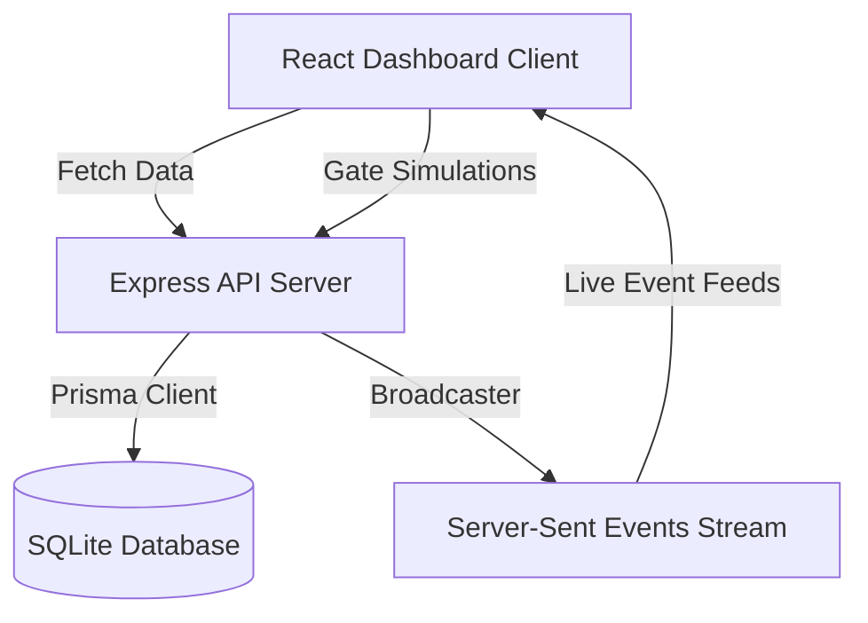

# Architecture & Data Flow

## System Design
The application uses a full-stack JavaScript architecture with real-time SSE updates:

## Data Flows

### RFID Transit Simulation
1. The driver triggers an entry simulation at a plaza (e.g. "Mindanao Ave").
2. The frontend sends a POST request containing the vehicle RFID tag to the backend.
3. The backend saves the transit event in memory.
4. When the driver triggers an exit simulation, the backend queries the database for the corresponding entry plaza, calculates the toll rate, deducts the fee from the vehicle balance, and saves the transaction.
5. The transaction event is broadcasted via SSE to update the dashboard.
